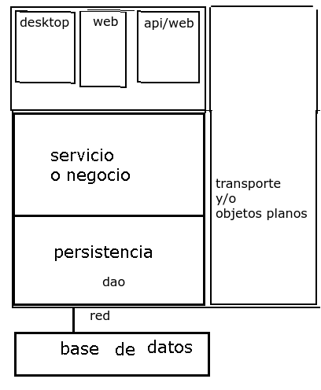
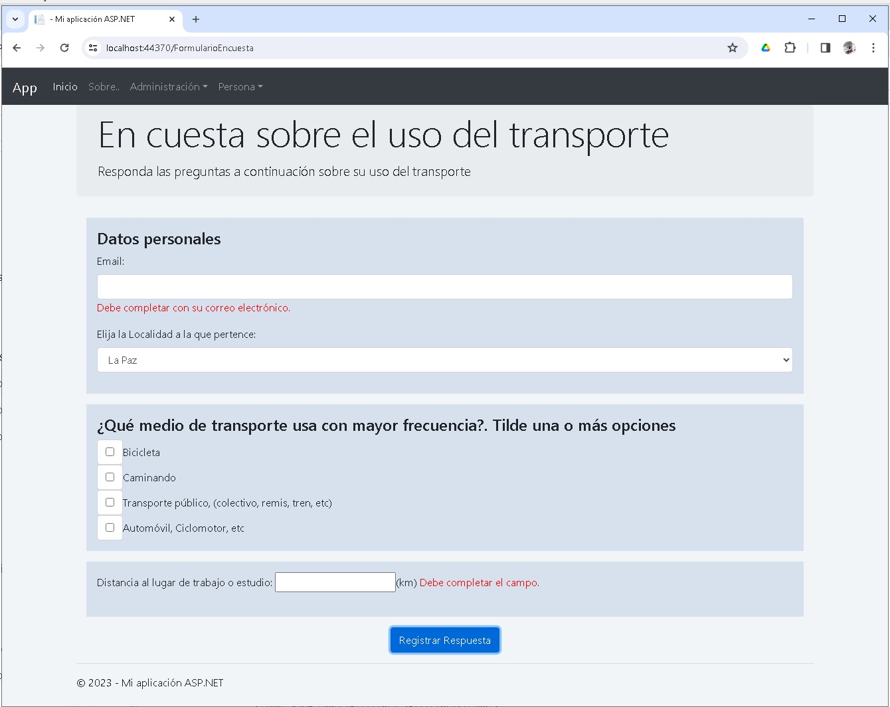

# Introducción a bases de datos, patrón dao, html, y WebForm

En este respositorio se desarrollan una seríe de temas a modo introducción a través de un escenario propuesto.

## Temas
* [Introducción a servicio, protocolo http, y páginas html](# 'Introducción a servicio, protocolo http, y páginas html')
* [Introducción Bases de datos en c#](# 'Introducción Bases de datos en c#')
* [Aplicaciones web - páginas de estilos, bootstrap e integración con bases de datos.](# 'Aplicaciones web - páginas de estilos, bootstrap e integración con bases de datos.')
* [Aplicaciones webform - ASP](# 'Aplicaciones webform - ASP')

## Introducción a servicio, protocolo http, y páginas html

        
web, primera parte

        Para eso se construye un pequeño servicio para ver como se forman las consultas (request) y respuestas (response) http, el hilo que atiende estas consultas, y que elementos html intervienen.

## Introducción Bases de datos en c#

        
Resumen.

1- Ejemplos de ejecución de queries sencillos desde aplicaciones de consola
        
2- Luego, apartir de esto se desarrolla el modelo de capas utilizando principalmente el patron dao -
        

        
        
Figura 1. Modelo de capas 
                  

                
en este punto como vista se trabaja una aplicación winform

                

## Aplicaciones web - páginas de estilos, bootstrap e integración con bases de datos.

        
web, segunda parte

## Aplicaciones webform - ASP

        
web, tercera parte

        

        
Menú principal

        

        
        
Figura 2. Menú principal 

Inicio del proceso de la encuesta

        
        
Figura 2. Menú de inicio de la encuesta

Proceso de cierre de la encuesta

        
        
Figura 3. Formulario para la consulta al usuario.

        
        
Figura 4. Formulario de resultados.

  

Formulario de consulta

        
        
Figura 5. Formulario para la consulta al usuario.

        
        
Figura 6. Formulario para la consulta al usuario- viendo los validadores.

 

